# 👋 Welcome to my bug collection.

 

My daily priorities:
1. Games
2. Facebook
3. Sleep
4. Panic
5. Code (optional)
 

## Booting developer

    

 

## Daily Routine

99 little bugs in the code.

Take one down, patch it around...

127 bugs in the code.

    

 

## Research Process

I came for one answer.

I left with 37 open tabs.

    

 

## Every Developer Has This Folder

Git exists.

I still made final_final.zip.

    

 

---

